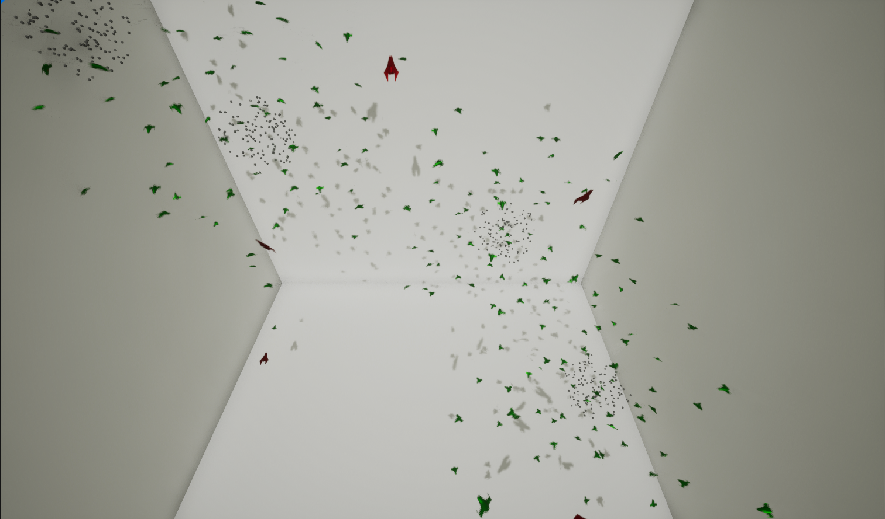

# UE5 Boids Flock Simulation and Evolution Algorithm

The project is set in the following scenario. In a bountiful and hostile galaxy, there exists two types of space ship group: harvesters and pirates. Harvesters focus on collecting resources from asteroid clusters, while pirates hunt for the harversters. Both of the two groups take action in flocks, and parameters controlling flock behavior are randomized in the beginning. Through time, ships gain points from surviving and collecting resources. They lose points from collisions with other entities or walls. When the number of ships of each group goes below a certain amount, evolution kicks in. New ships are spawned through breeding and mutating of the current ships based on points. In later sections, each component of the program is explained in details.

## Evolution Manager
EvolutionManager.h, EvolutionManager.cpp

The evolution manager is in charge of breeding, mutation, and population controll of the evolution process.

### Related Structures
`EGeneKey`: An enum representing the properties a gene holds.

`UGene`: A class holding the gene of a ship, represented by an array of floats.

`FBoidInfo`: A struct holding the information of a ship, including its gene, fitness (points of the ship, referred to as fitness from this point on), and name.

### Methods
`UGene* GenerateRandomGene(bool IsHarvester = false)`

Creates and randomizes a gene.

`void ApplyToBoid(UGene* Gene, ABoid* Boid, bool IsHarvester = false)`

Applies the properties of a gene to a ship and assign the gene itself to the ship.

`void InitBoidGene(ABoid* Boid, bool IsHarvester = false)`

Calls the above two functions.

`TTuple<UGene*, UGene*> BreedingMutationIndividual(UGene* ParentA, UGene* ParentB, bool IsHarvester = false)`

Randomly combines the genes of ParentA and ParentB to form two new genes, with a chance of mutation by discarding parents' gene and randomizing one.

`void PrintStengths(UGene* Gene)`

Prints the gene that is passed in.

`TArray<FBoidInfo> SortByFitness(TArray<ABoid*>& AliveBoids, TArray<FBoidInfo>& DeadBoids)`

Sorts the ships by fitness in descending order and returns the sorted info.

`UGene* SelectParent(const TArray<FBoidInfo>& BoidData, float TotalFitness)`

Select a parent based on fitness. The higher the fitness, the higher the chance a ship is selected.

`TArray<UGene*> BreedingMutation(const TArray<FBoidInfo>& BoidData, int32 Count, bool IsHarvester = false)`

Selects parents and creates child genes. Generates 2 * Count number of new genes.

`void PopulationSelection(const TArray<ABoid*>& AliveBoids, int32 Count)`

Destroys Count number of ships from the game.

## Spawner
In charge of spawning ships and trigger evolution

## Boids
`virtual FVector AvoidBoids(TArray<AActor*> Flock)`

`virtual FVector VelocityMatching(TArray<AActor*> Flock)`

`virtual FVector FlockCentering(TArray<AActor*> Flock)`

`virtual FVector AvoidObstacle()`

`virtual FVector Migration()`

The above functions represent the boid forces for each ship. They are overloaded by Harverster and Pirate to match their own behaviors, but the ways to calculate those forces stay unchanged.

`virtual void FlightPath(float DeltaTime)`: Combines the above boid forces and calculate the velocity of the current ship in this time frame. Clips the velocity within a certain range if necessary.
